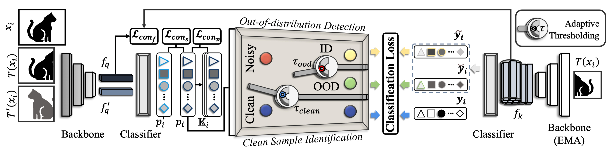

# Jo-SNC (Combating Noisy Labels through Fostering Selfand Neighbor-Consistency)
>This repository is the official PyTorch implementation of the paper "**Combating Noisy Labels through Fostering Selfand Neighbor-Consistency**".  
<!-- >This paper is an extension of *Jo-SRC: A Contrastive Approach for Combating Noisy Labels, CVPR 2021*. -->

## Abstract
>Label noise is pervasive in various real-world scenarios, posing challenges in supervised deep learning. Deep networks are vulnerable to such label-corrupted samples due to the memorization effect. Previous methods typically concentrate on identifying clean data for training. However, these methods often neglect imbalances in label noise across different mini-batches and devote insufficient attention to out-of-distribution noisy data. To this end, we propose a noise-robust method named Jo-SNC (Joint sample selection and model regularization based on Self- and Neighbor-Consistency). Specifically, we propose to employ the Jensen-Shannon divergence to measure the “likelihood” of a sample being clean or out-of-distribution. This process factors in the nearest neighbors of each sample to reinforce the reliability of clean sample identification. We design a self-adaptive, data-driven thresholding scheme to adjust per-class selection thresholds. While clean samples undergo conventional training, detected in-distribution and out-of-distribution noisy samples are trained following partial label learning and negative learning, respectively. Finally, we advance the model performance further by proposing a triplet consistency regularization that promotes self-prediction consistency, neighbor-prediction consistency, and feature consistency. Extensive experiments on various benchmark datasets and comprehensive ablation studies demonstrate the effectiveness and superiority of our approach over existing state-of-the-art methods.

><center>The workflow of Jo-SNC.</center>

## Requirements
- python 3.9
- torch == 1.12.1
- torchvision == 0.13.1
- CUDA 12.1

After creating a virtual environment of python 3.9, run `pip install -r requirements.txt` to install all dependencies

## Model Zoo
|  **Dataset**  |    **Backbone**     |                                         **Model**                                         |
|:-------------:|:-------------------:|:-----------------------------------------------------------------------------------------:|
| Web-Aircraft  |      ResNet50       |           [model](https://josnc.oss-cn-shanghai.aliyuncs.com/web_aircraft.pth)            |
|   Web-Bird    |      ResNet50       |             [model](https://josnc.oss-cn-shanghai.aliyuncs.com/web_bird.pth)              |
|    Web-Car    |      ResNet50       |              [model](https://josnc.oss-cn-shanghai.aliyuncs.com/web_car.pth)              |
|  Animal-10N   |        VGG19        |             [model](https://josnc.oss-cn-shanghai.aliyuncs.com/animal10n.pth)             |
| miniWebVision |      ResNet50       |      [model](https://josnc.oss-cn-shanghai.aliyuncs.com/mini_webvision_resnet50.pth)      |
| miniWebVision | Inception-ResNet-v2 | [model](https://josnc.oss-cn-shanghai.aliyuncs.com/mini_webvision_inception_resnetv2.pth) |
|   Food101N    |      ResNet50       |             [model](https://josnc.oss-cn-shanghai.aliyuncs.com/food101n.pth)              |

## Dataset Preparation
- Create `../datasets` folder
- Download the dataset into `../datasets` folder
- Please make sure the project directory is organized as following
```
<project_dir> 
            |-- results
            |-- datasets
                |-- web-aircraft
                |-- cifar100
                |-- animal10n
                |-- ...
            |-- code
                |-- config
                |-- main.py
                |-- ...
```

## Training
- Prepare data
- Activate the virtual environment (e.g., conda) and run the training command with specified `GPU_ID` like following
```
bash scripts/aircraft.sh ${GPU_ID}
```
``Note:`` More training scripts are in the `scripts` directory

## Testing
- Prepare data
- Download trained models from the above model zoo.
- Activate the virtual environment (e.g., conda) and run the testing command with specified `GPU_ID` like following
```
python demo.py --cfg config/aircraft.yaml --model-path web_aircraft.pth --gpu ${GPU_ID}
```


## Qualitative Results
### Sample Selection Results

<center>Examples of samples distinguished by our method from Web-Aircraft, Web-Bird, and Web-Car. Their given labels are “737-900”, “Mangrove Cuckoo”, and “Mercedes-Benz E-Class Sedan 2012”. The green, orange, and red bounding boxes mean that they are identified as clean, ID noisy, and OOD noisy samples, respectively.</center>